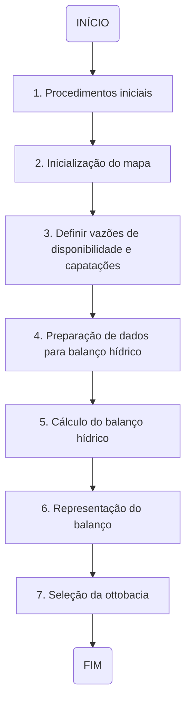
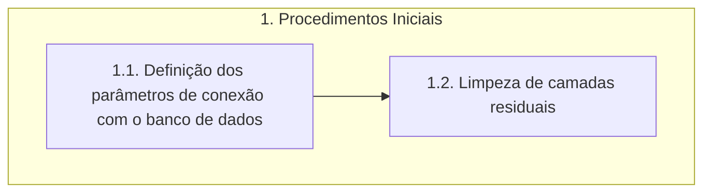
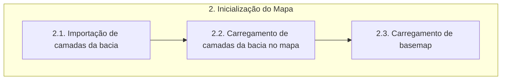
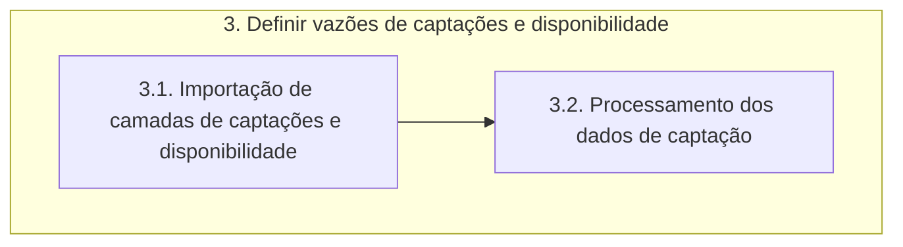
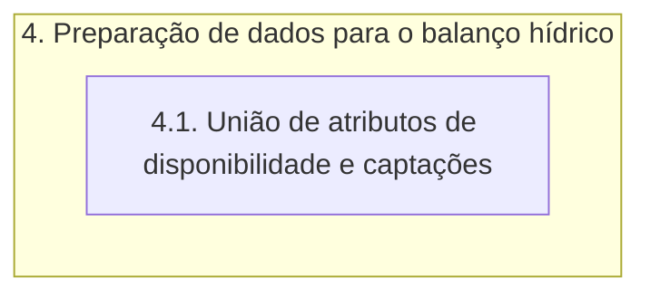
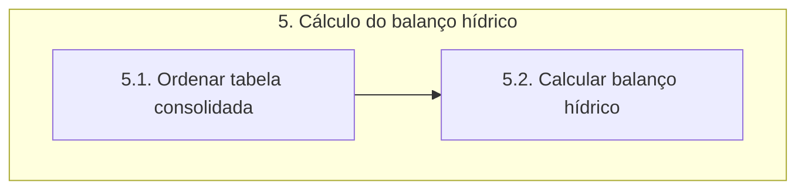
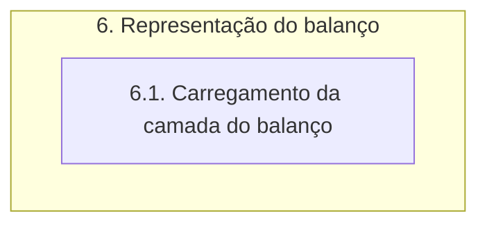
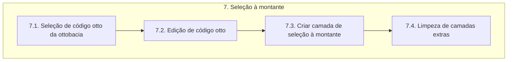

# Documentação - ParaibaHidroGIS

>:bulb: **Sugestão Bruno:** Criar uma primeira etapa de gerenciamento de banco de dados para adicionar camadas no banco. Essa etapa deve preparar as camadas (Ex: Definição de cabeceiras).\
:bulb: **Sugestão Bruno:** Criar uma etapa adicional (etapa 8) para que seja apresentada a janela de informações.

## Resumo da ferramenta

Esta ferramenta está sendo desenvolvida com o propósito de servir para o auxílio nos trabalhos de projetos de Recursos Hídricos, sendo um facilitador nos procedimentos de cálculo do balanço hídrico.

O desenvolvimento é realizado no contexto do projeto do **Plano de Recursos Hídricos da Bacia do Rio Paraíba(PRH-BPB)**.

Baseado na liguagem de programação python incorporada ao software QGIS.

## Objetivos da documentação

Esta documentação tem por objetivo primordial orientar a equipe de desenvolvimento de modo a detalhar todas as etapas e processos de execução da ferramenta. Deve ser utilizada também como material de consulta para utilização por profissionais envovidos nas etapas de testes e validação de suas funcionalidades.

## Estrutura

A estrutura funcional da ferramenta foi criada de forma hierarquica de modo a propiciar melhor entendimento sobre todo os detalhes das etapas envolvidas no processo de execução da ferramenta. Para isto, foram definidos os conceitos de **Etapas**, **Processos** e **Funções**.

- **ETAPAS:** O primeiro nível de organização estrutural. Neste nível abstrai-se qualquer tipo de detalhamento, sendo apenas descritos de forma geral o processo do início ao fim.

- **PROCESSOS:** O segundo nível de organização estrutural. Neste nível apresenta-se um detalhamento maior das etapas, a fim de que se possa diminuir o nível de abastração e identificar melhor as funcionalidades.

- **FUNÇÕES:** O terceiro nível de organização estrutural. Neste nível são detalhadas todas as funções executadas em cada processo, de modo individual. É o nível com menor grau de abstração, sendo possível identificar todas as estruturas funcionais da ferramenta.

## Fluxograma de etapas

## Fluxograma dos processos

Esta seção destina-se a descrição das etapas apresentadas no fluxograma anterior, mostrando seus processos.

### 1.Procedimentos iniciais

>:bulb: **Sugestão Tonico**: após carregar o banco o usuário saberá se há ou não cenários armazenados com resultados do balanço. Se houver, ele poderá escolher se vai para a próxima etapa (Etapa 2) rodar um novo cenário ou se vai direto para a Etapa 6 para ver os resultados.

## 2. Inicialização do Mapa

## 3. Definir vazões de disponibilidade e captações

## 4. Preparação de dados para balanço hídrico

## 5. Cálculo do balanço hídrico

## 6. Representação do balanço

## 7. Seleção da ottobacia

