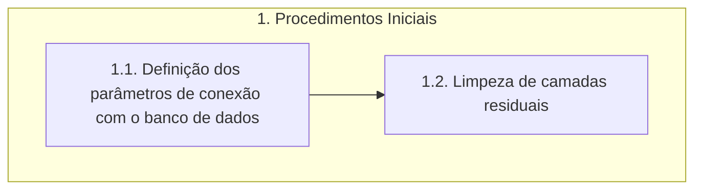

# Documentação - ParaibaHidroGIS

### 1.Procedimentos iniciais

>:bulb: **Sugestão Tonico**: após carregar o banco o usuário saberá se há ou não cenários armazenados com resultados do balanço. Se houver, ele poderá escolher se vai para a próxima etapa (Etapa 2) rodar um novo cenário ou se vai direto para a Etapa 6 para ver os resultados.

O fluxograma de processos desta etapa é apresentado a seguir:

### 1.1. Definição dos parâmetros de conexão com o Banco de Dados

A função **parametros_padrao_bd** define os parâmetros de conexão *padrão* com o banco de dados. 

> **Parâmetros padrão**:
>- host: localhost
>- nome: bdg_prh_rpb
>- usuario: postgres
>- senha: cobrape
>- porta: 5432
>- schema: public

#### 1.1.1. Definição do dicionário

>:warning: Verificar o nível.

A variável **parametros_conexao** cria um dicionário que contém parâmetros de conexão padrão (host, nome do banco, usuário, senha, porta e schema) com o banco de dados. 

#### 1.1.2. Verificação da conexão PostGIS

>:warning: Verificar o nível.

A função **verifica_parametros_bd** apresenta os parâmetros de conexão com o banco de dados e possibilita ao usuário decidir se mantém os parâmetros de conexão padrão ou se deseja inserir parâmetros personalizados.

A variável **verifica_postgis** utiliza a classe **QMessageBox** para verificar se o usuário deseja continuar com os parâmetros de conexão padrão ou se deseja alterar os parâmetros de entrada. 

> A classe **QMessageBox** faz parte do framework Qt e é usada para criar e gerenciar caixas de diálogo que exibem mensagens para o usuário, podendo ser utilizadas para fornecer informações, pedir confirmação ou solicitar entrada do usuário.

Se a resposta do usuário for *sim*, a leitura do código será continuada e serão utilizados os parâmetros padrão.

Se a resposta for *não*, o código segue para a função **patrametros_personalizados_bd**.

#### 1.1.3. Definição dos parâmetros personalizados

A função **parametros_personalizados_bd** utiliza a classe **QInputDialog** para obter novos valores para os parâmetros de conexão. A classe é utilizada para cada parâmetro de conexão (host, nome do banco, usuário, senha, porta e schema) e, portanto, o processo é repetido seis vezes. 

O código faz a verificação se algum campo ficou vazio. Em casos que o usuário deixe os campos vazios, será utilizado os parâmetros de conexão padrão.

Depois de inserir os valores, é chamada a função **verifica_parametros_bd** onde são atualizados os parâmetros de conexão.

> A classe **QInputDialog** faz parte do framework Qt e é utilizada para criar caixas de diálogo que solicitam entrada do usuário. Essas caixas de diálogo podem ser usadas para coletar informações como texto, números ou opções de uma lista. 

### 1.2. Limpeza das camadas residuais

A função **limpeza_residuos** realiza a limpeza de camadas residuais do projeto no QGIS. 

A variável **camada_residual** utiliza o **QgsProject.instance** para obter um dicionário de todas as camadas do projeto usando o método mapLayers() da instância do projeto e, em seguida, obtém os valores desse dicionário, resultando em uma lista de todas as camadas no projeto.

>O **QgsProject** é uma classe central no QGIS que representa o projeto em si. Ele armazena informações sobre camadas, configurações do projeto, sistemas de coordenadas e outros elementos relacionados ao ambiente de trabalho no QGIS. 

Após a criação da lista com as camadas do projeto, é feita a verificação da existência de camadas residuais, caso haja qualquer camada residual é feita a remoção da mesma. Caso contrário, será apenas obtido e atualizado o canvas do mapa do projeto utilizando o **qgis.utils.iface.mapCanvas()** e o **canvas.refresh()**.

> O **iface** é uma instância da classe QgisInterface que fornece acesso às interfaces do QGIS para plugins. O *mapCanvas* é o método utilizado para obter a referência à tela de visualização do mapa atual no QGIS.