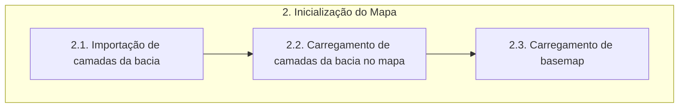

# Documentação - ParaibaHidroGIS

## 2. Inicialização do Mapa

O fluxograma de processos desta etapa é apresentado a seguir:

### 2.1. Importação de camadas da bacia

>:warning: Correção de estilo no carregamento da camada de ottobacias, deixar mais fina e mais clara.
>:warning: Correção de estilo no carregamento da camada de ottotrechos, colocar um azul mais escuro.

Nesse processo será feita a importação das camadas do banco de dados.

> O **import requests** faz a importação da biblioteca Requests, a qual é utilizada para fazer requisições HTTP em python de forma simples e eficiente.

A função **importar_camada_bdg** recebe informações sobre o banco de dados (nome, senha, schema, nome da camada) para importar a camada vetorial correspondente.

A variável *uri* utiliza o **QgsDataSourceUri** para armazenar informações sobre a fonte de dados da camada vetorial, e, posteriormente, configura as informações de conexão com o banco de dados na URI. 

> O **QgsDataSourceUri** é uma classe na biblioteca QGIS que é usada para representar e manipular informações de conexão com fontes de dados, como bancos de dados espaciais, arquivos shapefile, serviços da web, entre outros. Essa classe permite que você construa e manipule de forma pragmática URIs (Uniform Resource Identifiers) que especificam a fonte de dados que será utilizada em um projeto QGIS.

A variável *camada_importada* cria um objeto **QgsVectorLayer** usando a URI configurada e define o nome da camada. 

> O **QgsVectorLayer** é uma classe na biblioteca QGIS que representa uma camada vetorial dentro do ambiente QGIS. Essa classe é parte da API do QGIS e é usada para manipular dados vetoriais, como pontos, linhas e polígonos. 

### 2.2. Carregamento de camadas da bacia no mapa

A função **carregar_camada** é responsável por configurar a simbologia de uma camada e adicioná-la ao projeto do QGIS. Recebe como entrada a camada e um dicionário de simbologia. A simbologia é definida alterando a cor do símbolo da camada usando *setColor* com base nos valores RGB e alfa (transparência) fornecidos no dicionário. Depois, adiciona-se a camada ao projeto do QGIS usando o **QgsProject.instance**.

> OBS: A classe **QgsProject** já foi definida na etapa 1.

### 2.3.  Carregamento de basemap

A função **importar_camada_fundo** tem como objetivo carregar uma camada de plano de fundo usando a biblioteca QGIS. 

A variável **service_url** contém uma URL para um serviço de mapas do Google. Os placeholders {x}, {y} e {z} são utilizados para representar os valores de latitude, longitude e zoom.

A variável **serivce_uri** contém a URI do serviço de mapas, formatada com os parâmetros necessários. A função **requests.utilis.quote** é usada para garantir que a URL seja codificada corretamente.

A função **iface.addRasterLayer** da interface do QGIS é utilizada para adicionar uma camada raster com os argumentos:
- service_uri: a URI do serviço de mapas
- Google_Road: nome da camada a ser adicionada
- wms: tipo de serviço, indicando que é um Web Map Service