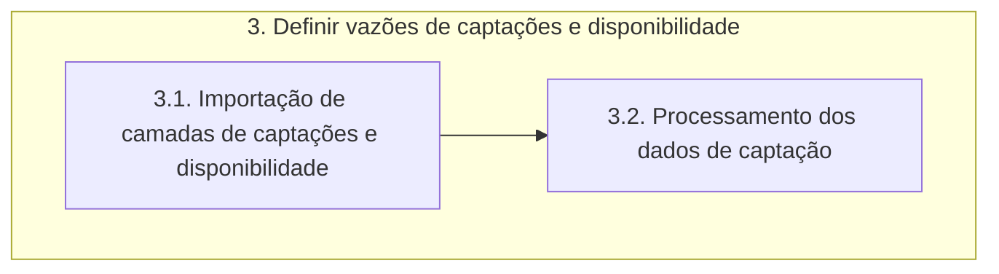

# Documentação - ParaibaHidroGIS

## 3. Definir vazões de disponibilidade e captações

O fluxograma de processos desta etapa é apresentado a seguir:

### 3.1 Importação de camadas de captações e disponibilidade

>:bulb: **Ideia**: Os dados de disponibilidade já estão por ottobacias, caso não estivesse pronto, os dados teriam que ser tratados fazendo o cruzamento como se fosse os setores censitários.

A função **importar_camada_bdg** recebe informações sobre o banco de dados (nome, senha, schema, nome da camada) para importar a camada vetorial correspondente.

A variável *uri* utiliza o **QgsDataSourceUri** para armazenar informações sobre a fonte de dados da camada vetorial, e, posteriormente, configura as informações de conexão com o banco de dados na URI. 

A variável *camada_importada* cria um objeto **QgsVectorLayer** usando a URI configurada e define o nome da camada. 

A função **carregar_camada** é responsável por configurar a simbologia de uma camada e adicioná-la ao projeto do QGIS. Recebe como entrada a camada e um dicionário de simbologia. A simbologia é definida alterando a cor do símbolo da camada usando *setColor* com base nos valores RGB e alfa (transparência) fornecidos no dicionário. Depois, adiciona-se a camada ao projeto do QGIS usando o **QgsProject.instance**.

> OBS: As classes QgsDataSourceUri, QgsVectorLayer e QgsProject já foram definidas na etapa 2. 

### 3.2. Processamento dos dados de captação

A função **processamento_captacao** recebe duas camadas como parâmetros: captacoes e ottobacias e realiza operações para obter a interseção das ottobacias e das outorgas.

A variável **processo_bacias_outorgas** utiliza o algoritmo de processamento do QGIS *native:intersection* para realizar a interseção entre as camadas captacoes e ottobacias. O resultado é armazenado na variável **intersecao_bacias_outorgas** e é gerado uma camada temporária no QGIS.

> O **native:intersection** representa uma ferramenta fornecida pelo processamento do QGIS e na função **processing.run** refere-se ao algoritmo de interseção nativo (built-in) do QGIS, chamando a ferramenta de interseção do QGIS para realizar uma operação de interseção entre duas camadas vetoriais.. 

A variável **context** faz a configuração de um contexto de expressão para trabalhar com o resultado da interseção, utilizando o **QgsExpressionContext**. Depois, é adicionado escopos ao contexto de expressão que definem o contexto no qual variáveis e funções serão avaliadas. Nesse caso, é utilizado a função **QgsExpressionContextUtils.globalProjectLayerScopes** para obter escopos globais de camadas do projeto com base na variável **intersecao_bacias_outorgas**.  

> A classe **QgsExpressionContext** é usada para definir o contexto no qual as expressões são avaliadas. Ela fornece um conjunto de variáveis e funções que podem ser usadas em expressões.

Na variável **processo_de_agrupamento_por_ottobacias**, o algoritmo **native:aggregate**  é utilizado para agregar os dados resultantes da interseção. O agrupamento é feito com base no campo *cobacia* e duas agregações são realizadas: uma para obter a cobacia que será utilizada e outra para calcular a soma das vazões. O resultado será armazenado em **captacao_ottobacia** e será gerada uma camada temporária no QGIS.

Em *AGGREGATES* são definidas as operações de agregação a serem realizadas.
- Aggregate: especifica o tipo de agregação a ser realizado.
- Delimiter: define o delimitador.
- Input: indica a coluna pela qual a operação de agregação será realizada.
- Length: define o comprimento da saída.
- Name: nome atribuído à nova coluna resultante da operação de agregação.
- Precision: define a precisão dos valores resultantes.
- Sub_type e type: definem o tipo de dados da nova coluna.
- Type_name: nome do tipo de dados.