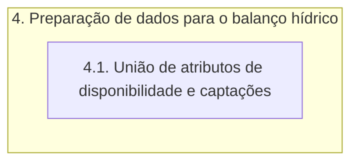

# Documentação - ParaibaHidroGIS

## 4. Preparação de dados para balanço hídrico

O fluxograma de processos desta etapa é apresentado a seguir:

### 4.1 União entre disponibilidade hídrica e captações

A função **uniao_trecho_disp_cap** realiza a união entre as camadas de ottotrechos, disponibilidade hídrica e de captações e retorna uma camada vetorial por meio de uma consulta SQL. 

O primeiro passo é criar uma string contendo a consulta SQL na variável **query_uniao**. Ela define essa consulta SQL que seleciona colunas específicas das camadas **camada_ottotrechos**, **camada_disponibilidade** e **camada_captacao_ottobacia**. 

A consulta SQL resultante retorna os campos: cobacia, cotrecho, nutrjus, cabeceira, disp_x e captação.

Posteriormente, é criada uma camada vetorial virtual chamada **trecho_disponibilidade_captacao** utilizando o **QgsVectorLayer** e então essa camada é adicionada ao projeto QGIS utilizando a instância do **QgsProject**.

> OBS: a classe **QgsProject** já foi definida na etapa 1 e a classe **QgsVectorLayer** foi definida na etapa 2.