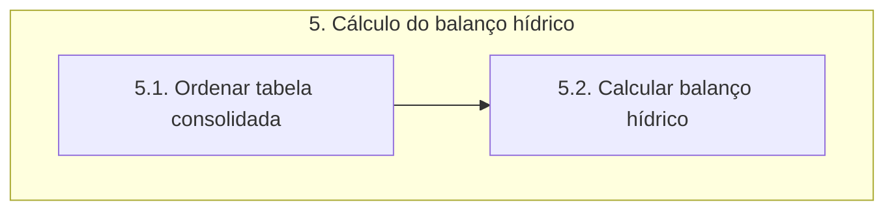

# Documentação - ParaibaHidroGIS

## 5. Cálculo do balanço hídrico

O fluxograma de processos desta etapa é apresentado a seguir:

> O módulo **psycopg2** importa uma biblioteca para trabalhar com o PostgreSQL em Python, podendo executar consultas SQL e realizar operações (Criar, Ler, Atualizar e Deletar).

### 5.1 Ordenar tabela consolidada

A função **criar_matriz_balanco** cria uma matriz de balanço hídrico a partir dos dados disponíveis da camada **trecho_disponibilidade_captacao** gerada na etapa anterior. 

Para isso é iniciada uma lista vazia chamada **matriz** que será utilizada para armazenar os dados da matriz de balanço. A variável **campos** obtém os campos disponíveis na camada **trecho_disponibilidade_captacao**, os quais serão adicionadas à matriz. Depois, é feito a iteração sobre as feições disponíveis e para cada feição é criada uma lista contendo os valores dos campos correspondentes à feição e é adicionada à matriz.

### 5.2 Calculo do Balanço Hídrico

A função **calcular_balanco** calcula o balanço de disponibilidade e captação de recursos hídricos em cada linha da matriz.

Para isso são realizadas iterações sobre cada linha da matriz, onde primeiramente é realizada a verificação se a linha representa um trecho de cabeceira ou não. Se o trecho for de cabeceira, a função calcula a vazão jusante subtraindo a captação da disponibilidade. 

Se o trecho não for de cabeceira, a função calcula a vazão jusante considerando os trechos montantes correspondentes. É feita uma iteração reversa para encontrar trechos montantes, ou seja, o loop faz a iteração sobre as linhas anteriores à linha atual, de trás para frente, comparando o código do trecho atual com o código do trecho jusante do trecho anterior. Se houver um trecho montante correspondente, a vazão jusante do trecho atual é calculada somando as vazões jusantes dos trechos montantes. A vazão montante é armazenada na matriz. A vazão jusante é calculada somando a vazão montante calculada ao valor da disponibilidade local e subtraindo a captação. 

Nos dois casos, se a vazão jusante calculada for menor que zero, isso indica um déficit e o mesmo é armazenado na matriz.

O cálculo do **Índice de Condição de Recursos Hídricos (ISR)** é feito com base na relação entre a captação e a disponibilidade total de água. Essa relação pe dividida em intervalos e o ISR é atribuído de acordo com esses intervalos. 

Por fim, a função retorna a matriz com os cálculos de vazão djusante, déficit e ISR para cada linha.

#### 5.2.1 Salvar resultados

A função **salvar_resultado** tem a finalidade de salvar os resultados do balanço hídrico em um banco de dados PostgreSQL. Primeiramente é realizada a conexão com o banco de dados usando os parâmetros de conexão. Depois, é feita a criação da estrutura de dados da VIEW **resultado_balanco** atráves de uma consulta SQL. 

Os valores da *matriz_balanco* são usados para inserir os dados na VIEW garantindo que ela contenha as informações atualizadas do balanço hídrico. Após a criação da VIEW, é feito um commit para confirmar as alterações no banco de dados. Um processo semelhante é realizado para a VIEW **ottobacias_isr**. Por fim, o cursor é fechado e a conexão com o banco de dados é encerrada.