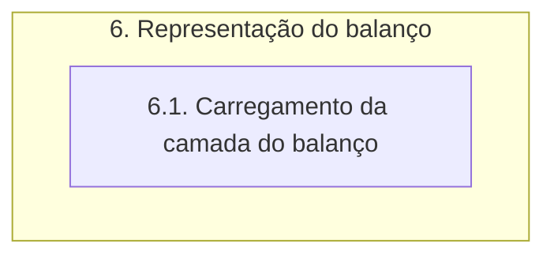

# Documentação - ParaibaHidroGIS

## 6. Representação do balanço

O fluxograma de processos desta etapa é apresentado a seguir:

A função **carregar_camada_balanco** é responsável por carregar uma camada de dados espaciais contendo informações sobre os Índices de Condição de Recursos Hídricos (ISR) no QGIS. 

A função utiliza uma instância de **QgsDataSourceUri**, já explicado no item 2.1.1, para configurar os parâmetros de conexão com o banco de dados PostgreSQL. Utilizando os parâmetros de conexão já configurados, a função define a fonte de dados *setDataSource* como a tabela **ottobacias_isr** no banco de dados PostgreSQL, criando um objeto de camada vetorial. A camada é adicionada ao projeto do QGIS utilizando o *addMapLayer* da instância do projeto.

Depois, é realizada a configuração da simbologia da camada com base nos valores únicos do campo **isr**. As cores dos símbolos são atribuídas com base em um dicionário **cores_classes** e os rótulos das categorias são definidos em um dicionário **rotulos_classes**. Por fim, é criado um renderizador de símbolos categorizado através do **QgsCategorizedSymbolRenderer**, o qual é atribuído à camada **ottobacias_icr**. 

O método **triggerRepaint** é chamado na camada para garantir que as alterações de simbologia sejam aplicadas e então, a função retorna a camada ottobacias_isr.

> OBS: a Classe **QgsDataSourceUri** já foi definida na etapa 2.\
A classe **QgsCategorizedSymbolRenderer** é utilizada para criar um renderizador de símbolos categorizados.\
 Através da classe **QgsRendererCategory** são definidas as categorias e os símbolos.