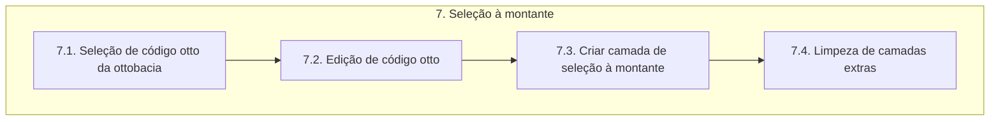

# Documentação - ParaibaHidroGIS

## 7. Seleção da ottobacia

O fluxograma de processos desta etapa é apresentado a seguir:

### 7.1. Seleção de código otto da ottobacia

É definida uma classe chamada **MapToolIdentify** que é uma extensão especializada da funcionalidade de identificação de feições fornecida pelo QGIS.

A variável **uri** configuram e adicionam uma nova camada vetorial ao projeto do QGIS. 

É definida uma função com o método **__init__** é o construtor da classe **MapToolIdentify** e é chamado quando uma instância da classe é criada. O método *super()* chama o construtor da classe **QgsMapToolIdentifyFeature** e o atributo *layer* é definido como a camada **ottobacias_isr**.

A função com o método **canvasReleaseEvent** é chamada sempre que ocorre um "clique" com o mouse no canvas do mapa. O método *super()* chama o **canvasReleaseEvent** para garantir que o comportamento padrão seja executado antes de executar qualquer código adicional.

A variável **feicao** identifica a feição na posição onde o mouse foi solto no canvas do mapa, usando a camada especificada. O **identify** retorna uma lista de feições naquela posição e seleciona a primeira feição. A partir dessa feição, obtemos o objeto *mFeature* que contém informações sobre a feição identificada.

A variável **cod_otto_bacia** recupera o valor do atributo *cobacia* da feição identificada, que representa o código da bacia hidrográfica.

Depois é feito a remoção da camada **ottobacias_isr** para que ela seja adicionada novamente mas com a simbologia atualizada para a seleção, semelhante ao que ocorre na etapa 6.

### 7.2. Edição de código otto

É feita uma iteração para a edição do código otto. É verificado se o código otto da bacia é par. Se for par, atribui seu valor a variável **cod_otto_e**. Se o código não for par, itera pelos caracteres do código até encontrar um que seja par. O código resultante é atrubuído a **cod_otto_e**.

### 7.3. Criar camada de seleção à montante

É estabelecida a conexão com o banco de dados PostgreSQL usando as informações de conexão fornecidas.

Depois, é executada uma consulta SQL para criar uma nova VIEW chamada **selecao_montante**, filtrando as feições da camada **ottobacias_isr** com base no **cod_otto_e** editado anteriormente. O comando **DROP VIEW IF EXISTS** exclui a visualização **selecao_montante**, se ela existir, juntamente com todas as dependências. O **CASCADE** garante que todas as dependências sejam excluídas juntamente com a visualização principal.

Sobre a consulta SQL:

- CREATE VIEW: cria a VIEW selecao_montante.
- FROM: é especificada a tabela ottobacias_isr como fonte de dados para a visualização
- WHERE: filtra as linhas da tabela com base em duas condições, primeiro a coluna cobacia é comparada com cod_otto_e e somente as linhas cujo valor começa com o mesmo valor serão selecionadas. Além disso, apenas as linhas com valores na coluna cobacia, maiores ou iguais a cod_otto_bacia são incluídas.

É criada uma nova camada vetorial chamada **selecao_montante** a partir da visualização SQL e sua renderização é definida com base em cores diferentes de acordo com o campo **isr** e atribui rótulos apropriados para cada categoria de dados.

### 7.4. Limpeza de camadas extras

A função **limpeza_camadas_extras** remove várias camadas adicionais do projeto do QGIS. Essa função é chamada para garantir que as camadas extras não interfiram com o restante do processo.