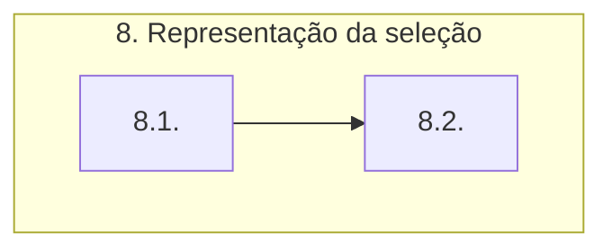

# Documentação - ParaibaHidroGIS

## 8. Representação da seleção

:warning: **Aviso:** o fluxograma ainda precisa ser atualizado.

O fluxograma de processos desta etapa é apresentado a seguir:

É estabelecida uma conexão com o banco de dados e criado um cursor a partir da conexão com o banco de dados para executar comandos SQL.

Com o cursor criado, é executado uma instrução SQL no banco de dados, conforme detalhado abaixo: 
- **f'''**: é uma string formatada, onde pode-se incluir variáveis e expressões python, isso permite que o valor do schema seja inserido na string.
- **SELECT & FROM**: seleciona a coluna cobacia da tabela ottobacia_Selecionada que está no schema especificado.

O **cursor.fetchone** retorna a próxima linha do conjunto de resultados da consulta SQL. Como só estamos buscando uma única coluna (cobacia), o resultado será uma tupla contendo um único elemento.

Depois disso, é feito a remoção da camada **ottobacias_isr** do projeto no QGIS.

Na variável **ottobacias_isr_sob** são definidas as configurações da simbologia da camada **ottobacias_isr_sob** com base nos valores únicos do campo **classe_isr**. As cores dos símbolos são atribuídas com base em um dicionário **cores_classes** e os rótulos das categorias são definidos em um dicionário **rotulos_classes**. Por fim, é criado um renderizador de símbolos categorizado através do **QgsCategorizedSymbolRenderer**, o qual é atribuído à camada **ottobacias_icr**. 

O método **triggerRepaint** é chamado na camada para garantir que as alterações de simbologia sejam aplicadas.

> OBS: A classe **QgsCategorizedSymbolRenderer** é utilizada para criar um renderizador de símbolos categorizados.\
 Através da classe **QgsRendererCategory** são definidas as categorias e os símbolos.

### 8.1. Edição de código otto
:warning: **Aviso:** os níveis ainda precisam ser verificados.

É feita uma iteração para a edição do código otto. É verificado se o código otto da bacia é par. Se for par, atribui seu valor a variável **cod_otto_e**. Se o código não for par, itera pelos caracteres do código até encontrar um que seja par. O código resultante é atrubuído a **cod_otto_e**.

Assim que o primeiro número par é encontrado, já que só estamos interessados na primeira sequência de números pares da direita para a esquerda, o loop é encerrado. 

A parte de execução de instrução SQL ocorre de forma semelhante ao citado acima, com a diferença que a VIEW criada é a **ottobacias_montante** no schema especificado, com base na tabela **ottobacias_isr** que está no mesmo schema. E por fim no *WHERE* será aplicada as condições de filtragem dos dados selecionados para a view. Ele seleciona apenas as linhas onde o valor da coluna cobacia começa com o valor de cod_otto_e (que é o código da bacia selecionada após o tratamento anterior)  e onde o valor da coluna cobacia é maior ou igual ao valor de cod_otto_bacia (que é o código original da bacia).

### 8.2. Seleção dos rios a jusante
:warning: **Aviso:** os níveis ainda precisam ser verificados.

Em um primeiro momento são definidas as variáveis para o trecho de jusante (rio, rios, compri). 

//revisar

Para realizar a seleção dos rios a jusante é feita uma iteração para definir o comprimento do código da ottobacia e testado se o número de dígitos é par ou impar, para redefinir as variáveis definidas.

Adição do shape dos trechos de jusante

São criados cursores para executar uma consulta SQL semelhante ao que já foi definido acima, com a diferença que será criada primeiramente a VIEW **ottotrechos_justante** e posteriormente a VIEW **ottotrechos_jusante_2**.

Semelhante ao já descrito acima, é feito a configuração da simbologia das camadas ottobacias_montante, camada_ottotrechos_jusante e camada_ottotrechos_jusante_2.

