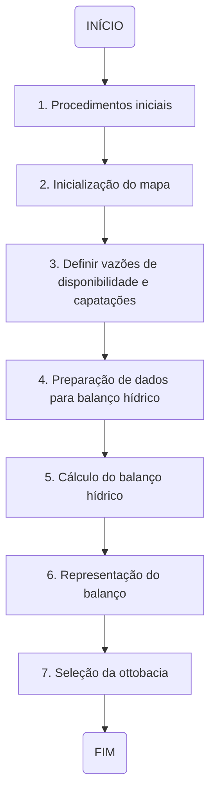
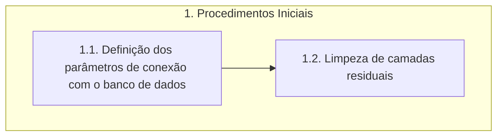
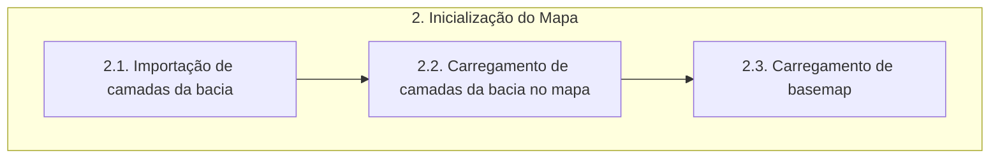
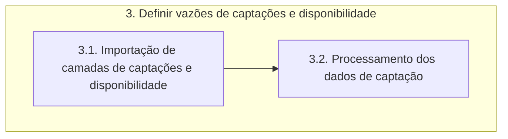
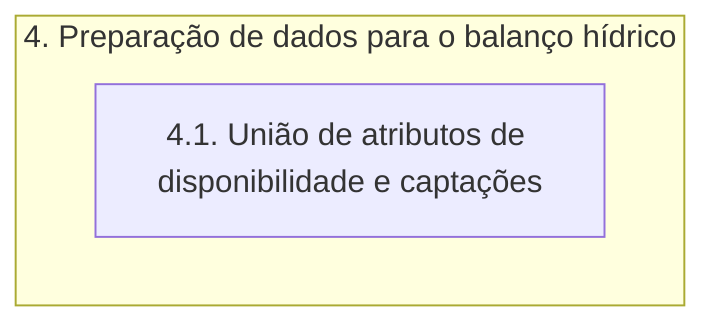
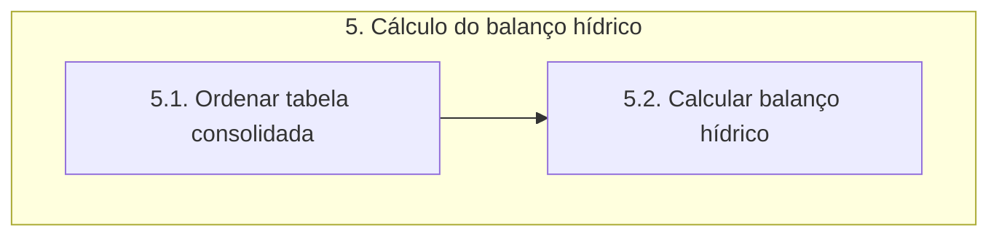
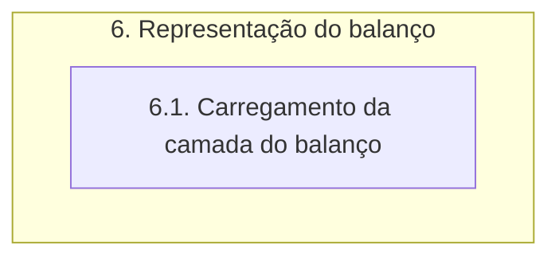
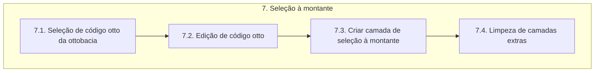

# Documentação - ParaibaHidroGIS

>:bulb: **Sugestão Bruno:** Criar uma primeira etapa de gerenciamento de banco de dados para adicionar camadas no banco. Essa etapa deve preparar as camadas (Ex: Definição de cabeceiras).\
:bulb: **Sugestão Bruno:** Criar uma etapa adicional (etapa 8) para que seja apresentada a janela de informações.

## Resumo da ferramenta

Esta ferramenta está sendo desenvolvida com o propósito de servir para o auxílio nos trabalhos de projetos de Recursos Hídricos, sendo um facilitador nos procedimentos de cálculo do balanço hídrico.

O desenvolvimento é realizado no contexto do projeto do **Plano de Recursos Hídricos da Bacia do Rio Paraíba(PRH-BPB)**.

Baseado na liguagem de programação python incorporada ao software QGIS.

## Objetivos da documentação

Esta documentação tem por objetivo primordial orientar a equipe de desenvolvimento de modo a detalhar todas as etapas e processos de execução da ferramenta. Deve ser utilizada também como material de consulta para utilização por profissionais envovidos nas etapas de testes e validação de suas funcionalidades.

## Estrutura

A estrutura funcional da ferramenta foi criada de forma hierarquica de modo a propiciar melhor entendimento sobre todo os detalhes das etapas envolvidas no processo de execução da ferramenta. Para isto, foram definidos os conceitos de **Etapas**, **Processos** e **Funções**.

- **ETAPAS:** O primeiro nível de organização estrutural. Neste nível abstrai-se qualquer tipo de detalhamento, sendo apenas descritos de forma geral o processo do início ao fim.

- **PROCESSOS:** O segundo nível de organização estrutural. Neste nível apresenta-se um detalhamento maior das etapas, a fim de que se possa diminuir o nível de abastração e identificar melhor as funcionalidades.

- **FUNÇÕES:** O terceiro nível de organização estrutural. Neste nível são detalhadas todas as funções executadas em cada processo, de modo individual. É o nível com menor grau de abstração, sendo possível identificar todas as estruturas funcionais da ferramenta.

## Fluxograma de etapas

## Descrição detalhada das etapas

Esta seção destina-se a descrição detalhada de todas as etapas apresentadas no fluxograma anterior, mostrando seus processos e explicando as respectivas funções.

### 1.Procedimentos iniciais

>:bulb: **Sugestão Tonico**: após carregar o banco o usuário saberá se há ou não cenários armazenados com resultados do balanço. Se houver, ele poderá escolher se vai para a próxima etapa (Etapa 2) rodar um novo cenário ou se vai direto para a Etapa 6 para ver os resultados.

O fluxograma de processos desta etapa é apresentado a seguir:

### 1.1. Definição dos parâmetros de conexão com o Banco de Dados

A função **parametros_padrao_bd** define os parâmetros de conexão *padrão* com o banco de dados. 

> **Parâmetros padrão**:
>- host: localhost
>- nome: bdg_prh_rpb
>- usuario: postgres
>- senha: cobrape
>- porta: 5432
>- schema: public

#### 1.1.1. Definição do dicionário

>:warning: Verificar o nível.

A variável **parametros_conexao** cria um dicionário que contém parâmetros de conexão padrão (host, nome do banco, usuário, senha, porta e schema) com o banco de dados. 

#### 1.1.2. Verificação da conexão PostGIS

>:warning: Verificar o nível.

A função **verifica_parametros_bd** apresenta os parâmetros de conexão com o banco de dados e possibilita ao usuário decidir se mantém os parâmetros de conexão padrão ou se deseja inserir parâmetros personalizados.

A variável **verifica_postgis** utiliza a classe **QMessageBox** para verificar se o usuário deseja continuar com os parâmetros de conexão padrão ou se deseja alterar os parâmetros de entrada. 

> A classe **QMessageBox** faz parte do framework Qt e é usada para criar e gerenciar caixas de diálogo que exibem mensagens para o usuário, podendo ser utilizadas para fornecer informações, pedir confirmação ou solicitar entrada do usuário.

Se a resposta do usuário for *sim*, a leitura do código será continuada e serão utilizados os parâmetros padrão.

Se a resposta for *não*, o código segue para a função **patrametros_personalizados_bd**.

#### 1.1.3. Definição dos parâmetros personalizados

A função **parametros_personalizados_bd** utiliza a classe **QInputDialog** para obter novos valores para os parâmetros de conexão. A classe é utilizada para cada parâmetro de conexão (host, nome do banco, usuário, senha, porta e schema) e, portanto, o processo é repetido seis vezes. 

O código faz a verificação se algum campo ficou vazio. Em casos que o usuário deixe os campos vazios, será utilizado os parâmetros de conexão padrão.

Depois de inserir os valores, é chamada a função **verifica_parametros_bd** onde são atualizados os parâmetros de conexão.

> A classe **QInputDialog** faz parte do framework Qt e é utilizada para criar caixas de diálogo que solicitam entrada do usuário. Essas caixas de diálogo podem ser usadas para coletar informações como texto, números ou opções de uma lista. 

### 1.2. Limpeza das camadas residuais

A função **limpeza_residuos** realiza a limpeza de camadas residuais do projeto no QGIS. 

A variável **camada_residual** utiliza o **QgsProject.instance** para obter um dicionário de todas as camadas do projeto usando o método mapLayers() da instância do projeto e, em seguida, obtém os valores desse dicionário, resultando em uma lista de todas as camadas no projeto.

>O **QgsProject** é uma classe central no QGIS que representa o projeto em si. Ele armazena informações sobre camadas, configurações do projeto, sistemas de coordenadas e outros elementos relacionados ao ambiente de trabalho no QGIS. 

Após a criação da lista com as camadas do projeto, é feita a verificação da existência de camadas residuais, caso haja qualquer camada residual é feita a remoção da mesma. Caso contrário, será apenas obtido e atualizado o canvas do mapa do projeto utilizando o **qgis.utils.iface.mapCanvas()** e o **canvas.refresh()**.

> O **iface** é uma instância da classe QgisInterface que fornece acesso às interfaces do QGIS para plugins. O *mapCanvas* é o método utilizado para obter a referência à tela de visualização do mapa atual no QGIS.

## 2. Inicialização do Mapa

O fluxograma de processos desta etapa é apresentado a seguir:

### 2.1. Importação de camadas da bacia

>:warning: Correção de estilo no carregamento da camada de ottobacias, deixar mais fina e mais clara.
>:warning: Correção de estilo no carregamento da camada de ottotrechos, colocar um azul mais escuro.

Nesse processo será feita a importação das camadas do banco de dados.

> O **import requests** faz a importação da biblioteca Requests, a qual é utilizada para fazer requisições HTTP em python de forma simples e eficiente.

A função **importar_camada_bdg** recebe informações sobre o banco de dados (nome, senha, schema, nome da camada) para importar a camada vetorial correspondente.

A variável *uri* utiliza o **QgsDataSourceUri** para armazenar informações sobre a fonte de dados da camada vetorial, e, posteriormente, configura as informações de conexão com o banco de dados na URI. 

> O **QgsDataSourceUri** é uma classe na biblioteca QGIS que é usada para representar e manipular informações de conexão com fontes de dados, como bancos de dados espaciais, arquivos shapefile, serviços da web, entre outros. Essa classe permite que você construa e manipule de forma pragmática URIs (Uniform Resource Identifiers) que especificam a fonte de dados que será utilizada em um projeto QGIS.

A variável *camada_importada* cria um objeto **QgsVectorLayer** usando a URI configurada e define o nome da camada. 

> O **QgsVectorLayer** é uma classe na biblioteca QGIS que representa uma camada vetorial dentro do ambiente QGIS. Essa classe é parte da API do QGIS e é usada para manipular dados vetoriais, como pontos, linhas e polígonos. 

### 2.2. Carregamento de camadas da bacia no mapa

A função **carregar_camada** é responsável por configurar a simbologia de uma camada e adicioná-la ao projeto do QGIS. Recebe como entrada a camada e um dicionário de simbologia. A simbologia é definida alterando a cor do símbolo da camada usando *setColor* com base nos valores RGB e alfa (transparência) fornecidos no dicionário. Depois, adiciona-se a camada ao projeto do QGIS usando o **QgsProject.instance**.

> OBS: A classe **QgsProject** já foi definida na etapa 1.

### 2.3.  Carregamento de basemap

A função **importar_camada_fundo** tem como objetivo carregar uma camada de plano de fundo usando a biblioteca QGIS. 

A variável **service_url** contém uma URL para um serviço de mapas do Google. Os placeholders {x}, {y} e {z} são utilizados para representar os valores de latitude, longitude e zoom.

A variável **serivce_uri** contém a URI do serviço de mapas, formatada com os parâmetros necessários. A função **requests.utilis.quote** é usada para garantir que a URL seja codificada corretamente.

A função **iface.addRasterLayer** da interface do QGIS é utilizada para adicionar uma camada raster com os argumentos:
- service_uri: a URI do serviço de mapas
- Google_Road: nome da camada a ser adicionada
- wms: tipo de serviço, indicando que é um Web Map Service

## 3. Definir vazões de disponibilidade e captações

O fluxograma de processos desta etapa é apresentado a seguir:

### 3.1 Importação de camadas de captações e disponibilidade

>:bulb: **Ideia**: Os dados de disponibilidade já estão por ottobacias, caso não estivesse pronto, os dados teriam que ser tratados fazendo o cruzamento como se fosse os setores censitários.

A função **importar_camada_bdg** recebe informações sobre o banco de dados (nome, senha, schema, nome da camada) para importar a camada vetorial correspondente.

A variável *uri* utiliza o **QgsDataSourceUri** para armazenar informações sobre a fonte de dados da camada vetorial, e, posteriormente, configura as informações de conexão com o banco de dados na URI. 

A variável *camada_importada* cria um objeto **QgsVectorLayer** usando a URI configurada e define o nome da camada. 

A função **carregar_camada** é responsável por configurar a simbologia de uma camada e adicioná-la ao projeto do QGIS. Recebe como entrada a camada e um dicionário de simbologia. A simbologia é definida alterando a cor do símbolo da camada usando *setColor* com base nos valores RGB e alfa (transparência) fornecidos no dicionário. Depois, adiciona-se a camada ao projeto do QGIS usando o **QgsProject.instance**.

> OBS: As classes QgsDataSourceUri, QgsVectorLayer e QgsProject já foram definidas na etapa 2. 

### 3.2. Processamento dos dados de captação

A função **processamento_captacao** recebe duas camadas como parâmetros: captacoes e ottobacias e realiza operações para obter a interseção das ottobacias e das outorgas.

A variável **processo_bacias_outorgas** utiliza o algoritmo de processamento do QGIS *native:intersection* para realizar a interseção entre as camadas captacoes e ottobacias. O resultado é armazenado na variável **intersecao_bacias_outorgas** e é gerado uma camada temporária no QGIS.

> O **native:intersection** representa uma ferramenta fornecida pelo processamento do QGIS e na função **processing.run** refere-se ao algoritmo de interseção nativo (built-in) do QGIS, chamando a ferramenta de interseção do QGIS para realizar uma operação de interseção entre duas camadas vetoriais.. 

A variável **context** faz a configuração de um contexto de expressão para trabalhar com o resultado da interseção, utilizando o **QgsExpressionContext**. Depois, é adicionado escopos ao contexto de expressão que definem o contexto no qual variáveis e funções serão avaliadas. Nesse caso, é utilizado a função **QgsExpressionContextUtils.globalProjectLayerScopes** para obter escopos globais de camadas do projeto com base na variável **intersecao_bacias_outorgas**.  

> A classe **QgsExpressionContext** é usada para definir o contexto no qual as expressões são avaliadas. Ela fornece um conjunto de variáveis e funções que podem ser usadas em expressões.

Na variável **processo_de_agrupamento_por_ottobacias**, o algoritmo **native:aggregate**  é utilizado para agregar os dados resultantes da interseção. O agrupamento é feito com base no campo *cobacia* e duas agregações são realizadas: uma para obter a cobacia que será utilizada e outra para calcular a soma das vazões. O resultado será armazenado em **captacao_ottobacia** e será gerada uma camada temporária no QGIS.

Em *AGGREGATES* são definidas as operações de agregação a serem realizadas.
- Aggregate: especifica o tipo de agregação a ser realizado.
- Delimiter: define o delimitador.
- Input: indica a coluna pela qual a operação de agregação será realizada.
- Length: define o comprimento da saída.
- Name: nome atribuído à nova coluna resultante da operação de agregação.
- Precision: define a precisão dos valores resultantes.
- Sub_type e type: definem o tipo de dados da nova coluna.
- Type_name: nome do tipo de dados.

## 4. Preparação de dados para balanço hídrico

O fluxograma de processos desta etapa é apresentado a seguir:

### 4.1 União entre disponibilidade hídrica e captações

A função **uniao_trecho_disp_cap** realiza a união entre as camadas de ottotrechos, disponibilidade hídrica e de captações e retorna uma camada vetorial por meio de uma consulta SQL. 

O primeiro passo é criar uma string contendo a consulta SQL na variável **query_uniao**. Ela define essa consulta SQL que seleciona colunas específicas das camadas **camada_ottotrechos**, **camada_disponibilidade** e **camada_captacao_ottobacia**. 

A consulta SQL resultante retorna os campos: cobacia, cotrecho, nutrjus, cabeceira, disp_x e captação.

Posteriormente, é criada uma camada vetorial virtual chamada **trecho_disponibilidade_captacao** utilizando o **QgsVectorLayer** e então essa camada é adicionada ao projeto QGIS utilizando a instância do **QgsProject**.

> OBS: a classe **QgsProject** já foi definida na etapa 1 e a classe **QgsVectorLayer** foi definida na etapa 2.

## 5. Cálculo do balanço hídrico

O fluxograma de processos desta etapa é apresentado a seguir:

> O módulo **psycopg2** importa uma biblioteca para trabalhar com o PostgreSQL em Python, podendo executar consultas SQL e realizar operações (Criar, Ler, Atualizar e Deletar).

### 5.1 Ordenar tabela consolidada

A função **criar_matriz_balanco** cria uma matriz de balanço hídrico a partir dos dados disponíveis da camada **trecho_disponibilidade_captacao** gerada na etapa anterior. 

Para isso é iniciada uma lista vazia chamada **matriz** que será utilizada para armazenar os dados da matriz de balanço. A variável **campos** obtém os campos disponíveis na camada **trecho_disponibilidade_captacao**, os quais serão adicionadas à matriz. Depois, é feito a iteração sobre as feições disponíveis e para cada feição é criada uma lista contendo os valores dos campos correspondentes à feição e é adicionada à matriz.

### 5.2 Calculo do Balanço Hídrico

A função **calcular_balanco** calcula o balanço de disponibilidade e captação de recursos hídricos em cada linha da matriz.

Para isso são realizadas iterações sobre cada linha da matriz, onde primeiramente é realizada a verificação se a linha representa um trecho de cabeceira ou não. Se o trecho for de cabeceira, a função calcula a vazão jusante subtraindo a captação da disponibilidade. 

Se o trecho não for de cabeceira, a função calcula a vazão jusante considerando os trechos montantes correspondentes. É feita uma iteração reversa para encontrar trechos montantes, ou seja, o loop faz a iteração sobre as linhas anteriores à linha atual, de trás para frente, comparando o código do trecho atual com o código do trecho jusante do trecho anterior. Se houver um trecho montante correspondente, a vazão jusante do trecho atual é calculada somando as vazões jusantes dos trechos montantes. A vazão montante é armazenada na matriz. A vazão jusante é calculada somando a vazão montante calculada ao valor da disponibilidade local e subtraindo a captação. 

Nos dois casos, se a vazão jusante calculada for menor que zero, isso indica um déficit e o mesmo é armazenado na matriz.

O cálculo do **Índice de Condição de Recursos Hídricos (ISR)** é feito com base na relação entre a captação e a disponibilidade total de água. Essa relação pe dividida em intervalos e o ISR é atribuído de acordo com esses intervalos. 

Por fim, a função retorna a matriz com os cálculos de vazão djusante, déficit e ISR para cada linha.

#### 5.2.1 Salvar resultados

A função **salvar_resultado** tem a finalidade de salvar os resultados do balanço hídrico em um banco de dados PostgreSQL. Primeiramente é realizada a conexão com o banco de dados usando os parâmetros de conexão. Depois, é feita a criação da estrutura de dados da VIEW **resultado_balanco** atráves de uma consulta SQL. 

Os valores da *matriz_balanco* são usados para inserir os dados na VIEW garantindo que ela contenha as informações atualizadas do balanço hídrico. Após a criação da VIEW, é feito um commit para confirmar as alterações no banco de dados. Um processo semelhante é realizado para a VIEW **ottobacias_isr**. Por fim, o cursor é fechado e a conexão com o banco de dados é encerrada.

## 6. Representação do balanço

O fluxograma de processos desta etapa é apresentado a seguir:

A função **carregar_camada_balanco** é responsável por carregar uma camada de dados espaciais contendo informações sobre os Índices de Condição de Recursos Hídricos (ISR) no QGIS. 

A função utiliza uma instância de **QgsDataSourceUri**, já explicado no item 2.1.1, para configurar os parâmetros de conexão com o banco de dados PostgreSQL. Utilizando os parâmetros de conexão já configurados, a função define a fonte de dados *setDataSource* como a tabela **ottobacias_isr** no banco de dados PostgreSQL, criando um objeto de camada vetorial. A camada é adicionada ao projeto do QGIS utilizando o *addMapLayer* da instância do projeto.

Depois, é realizada a configuração da simbologia da camada com base nos valores únicos do campo **isr**. As cores dos símbolos são atribuídas com base em um dicionário **cores_classes** e os rótulos das categorias são definidos em um dicionário **rotulos_classes**. Por fim, é criado um renderizador de símbolos categorizado através do **QgsCategorizedSymbolRenderer**, o qual é atribuído à camada **ottobacias_icr**. 

O método **triggerRepaint** é chamado na camada para garantir que as alterações de simbologia sejam aplicadas e então, a função retorna a camada ottobacias_isr.

> OBS: a Classe **QgsDataSourceUri** já foi definida na etapa 2.\
A classe **QgsCategorizedSymbolRenderer** é utilizada para criar um renderizador de símbolos categorizados.\
 Através da classe **QgsRendererCategory** são definidas as categorias e os símbolos.

## 7. Seleção da ottobacia

O fluxograma de processos desta etapa é apresentado a seguir:

### 7.1. Seleção de código otto da ottobacia

É definida uma classe chamada **MapToolIdentify** que é uma extensão especializada da funcionalidade de identificação de feições fornecida pelo QGIS.

A variável **uri** configuram e adicionam uma nova camada vetorial ao projeto do QGIS. 

É definida uma função com o método **__init__** é o construtor da classe **MapToolIdentify** e é chamado quando uma instância da classe é criada. O método *super()* chama o construtor da classe **QgsMapToolIdentifyFeature** e o atributo *layer* é definido como a camada **ottobacias_isr**.

A função com o método **canvasReleaseEvent** é chamada sempre que ocorre um "clique" com o mouse no canvas do mapa. O método *super()* chama o **canvasReleaseEvent** para garantir que o comportamento padrão seja executado antes de executar qualquer código adicional.

A variável **feicao** identifica a feição na posição onde o mouse foi solto no canvas do mapa, usando a camada especificada. O **identify** retorna uma lista de feições naquela posição e seleciona a primeira feição. A partir dessa feição, obtemos o objeto *mFeature* que contém informações sobre a feição identificada.

A variável **cod_otto_bacia** recupera o valor do atributo *cobacia* da feição identificada, que representa o código da bacia hidrográfica.

Depois é feito a remoção da camada **ottobacias_isr** para que ela seja adicionada novamente mas com a simbologia atualizada para a seleção, semelhante ao que ocorre na etapa 6.

### 7.2. Edição de código otto

É feita uma iteração para a edição do código otto. É verificado se o código otto da bacia é par. Se for par, atribui seu valor a variável **cod_otto_e**. Se o código não for par, itera pelos caracteres do código até encontrar um que seja par. O código resultante é atrubuído a **cod_otto_e**.

### 7.3. Criar camada de seleção à montante

É estabelecida a conexão com o banco de dados PostgreSQL usando as informações de conexão fornecidas.

Depois, é executada uma consulta SQL para criar uma nova VIEW chamada **selecao_montante**, filtrando as feições da camada **ottobacias_isr** com base no **cod_otto_e** editado anteriormente. O comando **DROP VIEW IF EXISTS** exclui a visualização **selecao_montante**, se ela existir, juntamente com todas as dependências. O **CASCADE** garante que todas as dependências sejam excluídas juntamente com a visualização principal.

Sobre a consulta SQL:

- CREATE VIEW: cria a VIEW selecao_montante.
- FROM: é especificada a tabela ottobacias_isr como fonte de dados para a visualização
- WHERE: filtra as linhas da tabela com base em duas condições, primeiro a coluna cobacia é comparada com cod_otto_e e somente as linhas cujo valor começa com o mesmo valor serão selecionadas. Além disso, apenas as linhas com valores na coluna cobacia, maiores ou iguais a cod_otto_bacia são incluídas.

É criada uma nova camada vetorial chamada **selecao_montante** a partir da visualização SQL e sua renderização é definida com base em cores diferentes de acordo com o campo **isr** e atribui rótulos apropriados para cada categoria de dados.

### 7.4. Limpeza de camadas extras

A função **limpeza_camadas_extras** remove várias camadas adicionais do projeto do QGIS. Essa função é chamada para garantir que as camadas extras não interfiram com o restante do processo.
