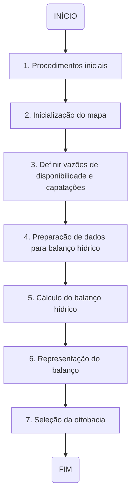
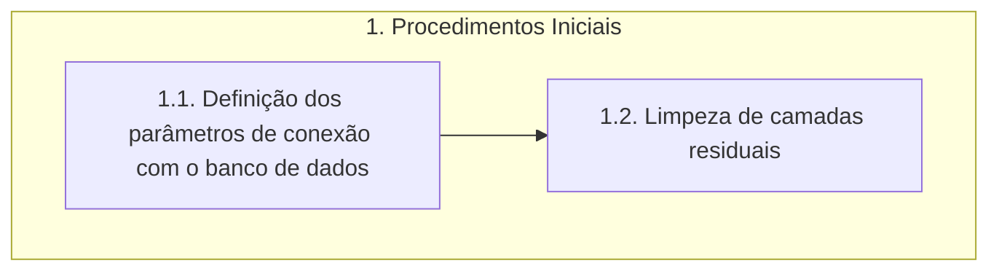
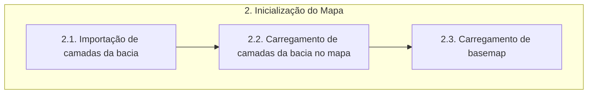
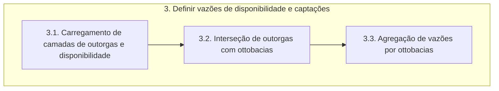
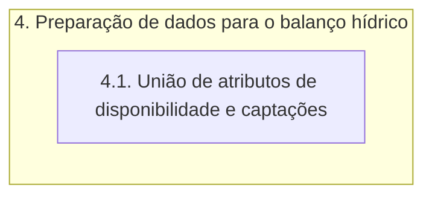
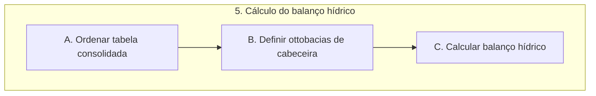

# Documentação - COB_HIDRO_001

>:memo: Alterar o nome do projeto.\
:bulb: **Sugestão Bruno:** Criar uma primeira etapa de gerenciamento de banco de dados para adicionar camadas no banco. Essa etapa deve preparar as camadas (Ex: Definição de cabeceiras).

## Resumo da ferramenta

Esta ferramenta está sendo desenvolvida com o propósito de servir para o auxílio nos trabalhos de projetos de Recursos Hídricos, sendo um facilitador nos procedimentos de cálculo do balanço hídrico.

O desenvolvimento é realizado no contexto do projeto do **Plano de Recursos Hídricos da Bacia do Rio Paraíba(PRH-BPB)**.

Baseado na liguagem de programação python incorporada ao software QGIS.

## Objetivos da documentação

Esta documentação tem por objetivo primordial orientar a equipe de desenvolvimento de modo a detalhar todas as etapas e processos de execução da ferramenta. Deve ser utilizada também como material de consulta para utilização por profissionais envovidos nas etapas de testes e validação de suas funcionalidades.

## Estrutura

A estrutura funcional da ferramenta foi criada de forma hierarquica de modo a propiciar melhor entendimento sobre todo os detalhes das etapas envolvidas no processo de execução da ferramenta. Para isto, foram definidos os conceitos de **Etapas**, **Processos** e **Funções**.

- **ETAPAS:** O primeiro nível de organização estrutural. Neste nível abstrai-se qualquer tipo de detalhamento, sendo apenas descritos de forma geral o processo do início ao fim.

- **PROCESSOS:** O segundo nível de organização estrutural. Neste nível apresenta-se um detalhamento maior das etapas, a fim de que se possa diminuir o nível de abastração e identificar melhor as funcionalidades.

- **FUNÇÕES:** O terceiro nível de organização estrutural. Neste nível são detalhadas todas as funções executadas em cada processo, de modo individual. É o nível com menor grau de abstração, sendo possível identificar todas as estruturas funcionais da ferramenta.

## Fluxograma de etapas

## Descrição detalhada das etapas

Esta seção destina-se a descrição detalhada de todas as etapas apresentadas no fluxograma anterior, mostrando seus processos e explicando as respectivas funções.

### 1.Procedimentos iniciais

>:bulb: **Sugestão Tônico**: após carregar o banco o usuário saberá se há ou não cenários armazenados com resultados do balanço. Se houver, ele poderá escolher se vai para a próxima etapa (Etapa 2) rodar um novo cenário ou se vai direto para a Etapa 6 para ver os resultados.

O fluxograma de processos desta etapa é apresentado a seguir:

### 1.1. Definição dos parâmetros de conexão com o Banco de Dados

A função **parametros_BDG** define os parâmetros de conexão *padrão* com o banco de dados. 

> **Parâmetros padrão**:
>- host: localhost
>- nome: bdg_prh_rpb
>- usuario: postgres
>- senha: cobrape
>- porta: 5432
>- schema: public

#### 1.1.1. Definição do dicionário

>:warning: Verificar o nível.

A variável **parametros_conexao** cria um dicionário que contém parâmetros de conexão padrão (host, nome do banco, usuário, senha, porta e schema) com o banco de dados. 

#### 1.1.2. Verificação da conexão PostGIS

>:warning: Verificar o nível.

A função **verifica_parametros_bd** apresenta os parâmetros de conexão com o banco de dados e possibilita ao usuário decidir se mantém os parâmetros de conexão padrão ou se deseja inserir parâmetros personalizados.

A variável **verifica_postgis** utiliza a classe **QMessageBox** para verificar se o usuário deseja continuar com os parâmetros de conexão padrão ou se deseja alterar os parâmetros de entrada. 

> A classe **QMessageBox** faz parte do framework Qt e é usada para criar e gerenciar caixas de diálogo que exibem mensagens para o usuário, podendo ser utilizadas para fornecer informações, pedir confirmação ou solicitar entrada do usuário.

Se a resposta do usuário for *sim*, a leitura do código será continuada e serão utilizados os parâmetros padrão.

Se a resposta for *não*, o código segue para a função **patrametros_personalizados_bd**.

#### 1.1.3. Definição dos parâmetros personalizados

>:warning: Verificar o nível.

A função **parametros_personalizados_bd** utiliza a classe **QInputDialog** para obter novos valores para os parâmetros de conexão. A classe é utilizada para cada parâmetro de conexão (host, nome do banco, usuário, senha, porta e schema) e, portanto, o processo é repetido seis vezes. 

O código faz a verificação se algum campo ficou vazio. Em casos que o usuário deixe os campos vazios, será utilizado os parâmetros de conexão padrão.

Depois de inserir os valores, é chamada a função **verifica_parametros_bd** onde são atualizados os parâmetros de conexão.

> A classe **QInputDialog** faz parte do framework Qt e é utilizada para criar caixas de diálogo que solicitam entrada do usuário. Essas caixas de diálogo podem ser usadas para coletar informações como texto, números ou opções de uma lista. 

### 1.2. Limpeza das camadas residuais

A função **limpeza_residuos** realiza a limpeza de camadas residuais do projeto no QGIS. 

A variável **camada_residual** utiliza o **QgsProject.instance** para obter um dicionário de todas as camadas do projeto usando o método mapLayers() da instância do projeto e, em seguida, obtém os valores desse dicionário, resultando em uma lista de todas as camadas no projeto.

>O **QgsProject** é uma classe central no QGIS que representa o projeto em si. Ele armazena informações sobre camadas, configurações do projeto, sistemas de coordenadas e outros elementos relacionados ao ambiente de trabalho no QGIS. 

Após a criação da lista com as camadas do projeto, é feita a verificação da existência de camadas residuais, caso haja qualquer camada residual é feita a remoção da mesma. Caso contrário, será apenas obtido e atualizado o canvas do mapa do projeto utilizando o **qgis.utils.iface.mapCanvas()** e o **canvas.refresh()**.

> O **iface** é uma instância da classe QgisInterface que fornece acesso às interfaces do QGIS para plugins. O *mapCanvas* é o método utilizado para obter a referência à tela de visualização do mapa atual no QGIS.

## 2. Inicialização do Mapa

O fluxograma de processos desta etapa é apresentado a seguir:

### 2.1. Importação de camadas da bacia

Nesse processo será feita a importação das camadas de ottobacia e ottotrechos.

#### 2.1.1. Importação da camada de ottobacia

>:warning: Correção de estilo no carregamento da camada de ottobacias, deixar mais fina e mais clara.

A função **importar_camada_ottobacias** recebe informações sobre o banco de dados (nome, senha, schema, nome da camada) para importar a camada vetorial correspondente.

A variável *uri* utiliza o **QgsDataSourceUri** para armazenar informações sobre a fonte de dados da camada vetorial, e, posteriormente, configura as informações de conexão com o banco de dados na URI. 

> O **QgsDataSourceUri** é uma classe na biblioteca QGIS que é usada para representar e manipular informações de conexão com fontes de dados, como bancos de dados espaciais, arquivos shapefile, serviços da web, entre outros. Essa classe permite que você construa e manipule de forma pragmática URIs (Uniform Resource Identifiers) que especificam a fonte de dados que será utilizada em um projeto QGIS.

A variável *ottobacias* cria um objeto **QgsVectorLayer** usando a URI configurada e define o nome da camada como *camada_ottobacias*. Depois é realizada a configuração da cor do símbolo da camada e por fim, adicionada a camada ao projeto QGIS.

> O **QgsVectorLayer** é uma classe na biblioteca QGIS que representa uma camada vetorial dentro do ambiente QGIS. Essa classe é parte da API do QGIS e é usada para manipular dados vetoriais, como pontos, linhas e polígonos. 

#### 2.1.2. Importação da camada de ottotrechos

>:warning: Correção de estilo no carregamento da camada de ottotrechos, colocar um azul mais escuro.

A função **importar_camada_ottotrechos** realiza o carregamento de camadas vetoriais de ottotrechos do banco de dados. Essa função funciona basicamente como a **importar_camada_ottobacias**, conforme descrito no tópico *2.1. Importação da camada de ottobacia*.

### 2.2. Carregamento das camadas da bacia

>:warning: Verificar com **Beatriz** o que precisa ser feito.

### 2.3.  Carregamento de basemap

A função **importar_camada_fundo** tem como objetivo carregar uma camada de plano de fundo usando a biblioteca QGIS. 

A variável **service_url** contém uma URL para um serviço de mapas do Google. Os placeholders {x}, {y} e {z} são utilizados para representar os valores de latitude, longitude e zoom.

A variável **serivce_uri** contém a URI do serviço de mapas, formatada com os parâmetros necessários. A função **requests.utilis.quote** é usada para garantir que a URL seja codificada corretamente.

A função **iface.addRasterLayer** da interface do QGIS é utilizada para adicionar uma camada raster com os argumentos:
- service_uri: a URI do serviço de mapas
- Google_Road: nome da camada a ser adicionada
- wms: tipo de serviço, indicando que é um Web Map Service

## 3. Definir vazões de disponibilidade e captações

>:warning: Vai precisar revisar essa etapa inteira na documentação depois de corrigir o código.

O fluxograma de processos desta etapa é apresentado a seguir:

### 3.1 Carregamento de camada de outorgas e disponibilidade

#### 3.1.1. Importação da camada de disponibilidade hídrica

>:warning: Precisa arrumar esse item (código e documentação).

A função **importar_disponibilidade_hidrica** realiza o carregamento de camadas vetorial de disponibilidade hídrica do banco de dados. Essa função funciona basicamente como a **importar_camada_ottobacias**, conforme descrito no tópico *2.1. Importação da camada de ottobacia*.

#### 3.1.2 Importação da camada de outorgas de captação

A função **importar_captacoes** realiza o carregamento de camadas vetorial de outorgas de captação do banco de dados. Essa função funciona basicamente como a **importar_camada_ottobacias**, conforme descrito no tópico *2.1. Importação da camada de ottobacia*.

### 3.2. Interseção de outorgas com ottobacias

A função **agregacao_vazao_captacao** recebe duas camadas como parâmetros: outorgas e ottobacias_montante e realiza operações para obter o valor da vazão nas ottobacias a montante da bacia de interesse.

A variável **processo_bacias_outorgas** utiliza o algoritmo de processamento do QGIS *native:intersection* para realizar a interseção entre as camadas outorgas e ottobacias_montante. O resultado é armazenado na variável **intersecao_bacias_outorgas** e é gerado uma camada temporária no QGIS.

O **native:intersection** representa uma ferramenta fornecida pelo processamento do QGIS e na função **processing.run** refere-se ao algoritmo de interseção nativo (built-in) do QGIS, chamando a ferramenta de interseção do QGIS para realizar uma operação de interseção entre duas camadas vetoriais.. 

A variável **context** faz a configuração de um contexto de expressão para trabalhar com o resultado da interseção. Depois, é adicionado escopos ao contexto de expressão que definem o contexto no qual variáveis e funções serão avaliadas. Nesse caso, é utilizado a função **QgsExpressionContextUtils.globalProjectLayerScopes** para obter escopos globais de camadas do projeto com base na variável **intersecao_bacias_outorgas**.  

> A classe **QgsExpressionContext** é usada para definir o contexto no qual as expressões são avaliadas. Ela fornece um conjunto de variáveis e funções que podem ser usadas em expressões.

### 3.3 Agregação de vazões por ottobacias

A variável **processo_de_agrupamento_por_ottobacias** utiliza o algoritmo **native:aggregate** para agregar os dados resultantes da interseção. O agrupamento é feito com base no campo *cobacia* e duas agregações são realizadas: uma para obter a cobacia que será utilizada e outra para calcular a soma das vazões. O resultado será armazenado em **agrupamento por ottobacias** e será gerada uma camada temporária no QGIS.

Em *AGGREGATES* são definidas as operações de agregação a serem realizadas.
- Aggregate: especifica o tipo de agregação a ser realizado.
- Delimiter: define o delimitador.
- Input: indica a coluna pela qual a operação de agregação será realizada.
- Length: define o comprimento da saída.
- Name: nome atribuído à nova coluna resultante da operação de agregação.
- Precision: define a precisão dos valores resultantes.
- Sub_type e type: definem o tipo de dados da nova coluna.
- Type_name: nome do tipo de dados.

## 4. Preparação de dados para balanço hídrico

>:warning: faltou adicionar união da captação nessa etapa, foi feito apenas para a disponibilidade hídrica.

O fluxograma de processos desta etapa é apresentado a seguir:

### 4.1 União entre disponibilidade hídrica e captações

A função **uniao_disponibilidade_captacoes** realiza a união entre as camadas de disponibilidade hídrica e de captações. 

O primeiro passo é criar uma string contendo a consulta SQL na variável **query_uniao**. Ela define essa consulta SQL que seleciona colunas específicas de duas camadas **camada_ottotrechos** e **camada_disp_hid** usando o *LEFT JOIN*. 

Posteriormente, é criada uma camada vetorial virtual chamada **disponibilidade_captacao** e essa camada é adicionada ao projeto QGIS utilizando a instância do **QgsProject**.

> OBS: a definição da classe **QgsProject** está explicada no item 1.2. da presente documentação.

## 5. Cálculo do balanço hídrico

>:memo: A ideia é salvar os resultados do balanço em views no banco, porém temos que fazer testes sobre o carregamento de views no QGIS.\
:warning: Criar uma nova funcionalidade para calcular o índice de criticidade, sendo que o resultado deve ser apresentado em uma camada com a classificação utilizada no artigo da ABRHidro.\
:warning: O resultado do balanço vai para o banco de dados e para uma camada no QGIS (visualização) e deve ser por ottobacias.

O fluxograma de processos desta etapa é apresentado a seguir:

## 6. Representação do balanço

>:warning: Precisa ser criada essa etapa e seus processos. Deverá ser representada por meio do índice de criticidade.

## 7. Seleção da ottobacia

>:warning: Precisa ser criada essa etapa e seus processos. Deve selecionar montante em destaque e mostrar um quadro com valores de resultados.