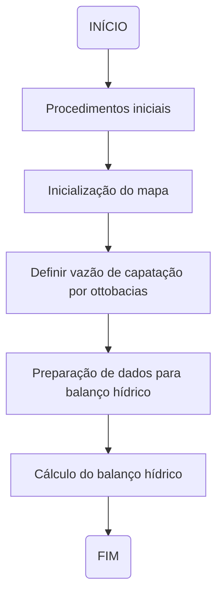
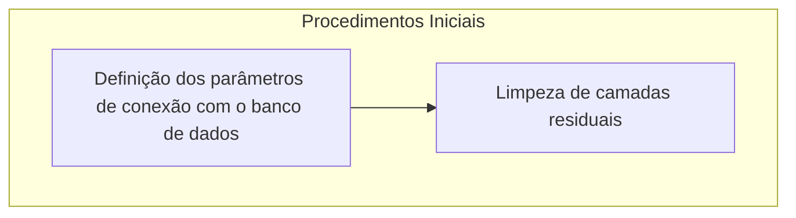
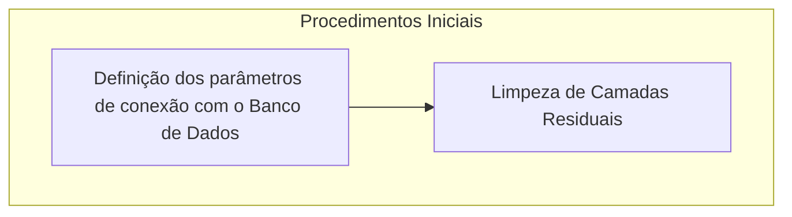
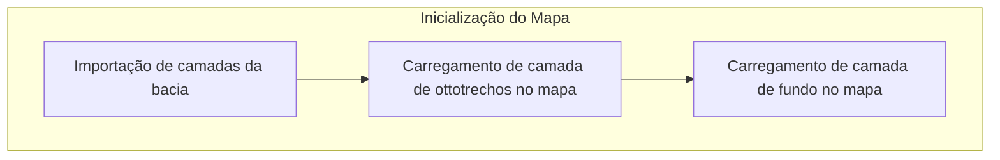
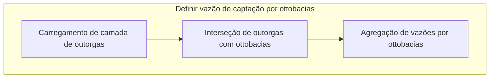
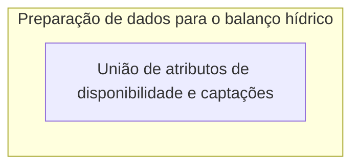
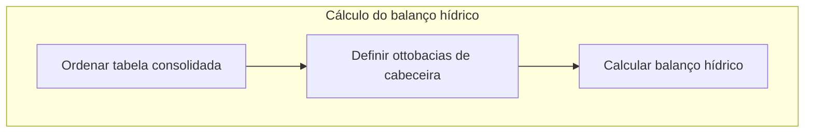

# Documentação - COB_HIDRO_001

## Resumo da ferramenta

Esta ferramenta esta sendo desenvolvida com o propósito de servir para o auxílio nos trabalhos de projetos de Recursos Hídricos, sendo um facilitador nos procedimentos de cálculo do balanço hídrico.

O desenvolvimento é realizado no contexto do projeto do **Plano de Recursos Hídricos da Bacia do Rio Paraíba(PRH-BPB)**.

Baseado na liguagem de programação python incorporada ao software QGIS.

## Objetivos da documentação

Esta documentação tem por objetivo primordial orientar a equipe de desenvolvimento de modo a detalhar todas as etapas e processos de execução da ferramenta. Deve ser utilizada também como material de consulta para utilização por profissionais envovidos nas etapas de testes e validação de suas funcionalidades.

## Estrutura

A estrutura funcional da ferramenta foi criada de forma hierarquica de modo a propiciar melhor entendimento sobre todo os detalhes das etapas envolvidas no processo de execução da ferramenta. Para isto forma definidos os conceitos de **Etapas**, **Processos** e **Funções**.

- **ETAPAS:** O primeiro nível de organização estrutural. Neste nível abstrai-se qualquer tipo de detalhamento, sendo apenas descritos de forma geral o processo do iinício ao fim.

- **PROCESSOS:** O segundo nível de organização estrutural. Neste nível apresenta-se um detalhamento maior das etapas, a fim de que se possa diminuir o nível de abastração e identificar melhor as funcionalidades.

- **FUNÇÕES:** O terceiro nível de organização estrutural. Neste nível são detalhadas todas as funções executadas em cada processo, de modo individual. É o nível com menor grau de abstração, sendo possível identificar todas as estruturas funcionais da ferramenta.

## Fluxograma de etapas

## Descrição detalhada das etapas

Esta seção destina-se a descrição detalhada de todas as etapas apresentadas no fluxograma anterior, mostrando seus processos e explicando as respectivas funções.

### 1.Procedimentos iniciais

O fluxograma de processos desta etapa é apresentado a seguir:

Esta etapa possui dois processos
- *Definição dos parâmetros de conexão com o Banco de Dados*
- *Limpeza de camadas residuais*

<!--
Nos procedimentos iniciais, são definidas duas funções:
- *parametros_BDG*
- *limpeza_residuos*
-->

### 1.1. Definição dos parâmetros de conexão com o Banco de Dados
---

A função **parametros_BDG** define os parâmetros de conexão com o banco de dados e possibilita ao usuário decidir se mantém os parâmetros de conexão padrão ou se deseja inserir parâmetros personalizados.

> **Parâmetros padrão**:
>- host: localhost
>- nome: bdg_prh_rpb
>- usuario: postgres
>- senha: cobrape
>- porta: 5432
>- schema: public

#### 1.1.1. Definição do dicionário

**parametros_conexao** cria um dicionário que contém parâmetros de conexão padrão (host, nome do banco, usuário, senha, porta e schema) com o banco de dados. 

#### 1.1.2. Verificação da conexão PostGIS

Utiliza a classe **QMessageBox** para verificar se o usuário deseja continuar com os parâmetros de conexão padrão ou se deseja alterar os parâmetros de entrada. 

> A classe **QMessageBox** faz parte do framework Qt e é usada para criar e gerenciar caixas de diálogo que exibem mensagens para o usuário, podendo ser utilizadas para fornecer informações, pedir confirmação ou solicitar entrada do usuário.

Se a resposta do usuário for *sim*, é utilizado o **pass** para que continue a leitura do código.  

Se a resposta for *não*, é utilizada a classe **QInputDialog** para obter novos valores para os parâmetros de conexão. A classe é utilizada para cada parâmetro de conexão (host, nome do banco, usuário, senha, porta e schema) e, portanto, o processo é repetido cinco vezes. O código faz a verificação se algum campo ficou vazio. Em casos que o usuário deixe os campos vazios, será utilizado os parâmetros de conexão padrão.

> A classe **QInputDialog** faz parte do framework Qt e é utilizada para criar caixas de diálogo que solicitam entrada do usuário. Essas caixas de diálogo podem ser usadas para coletar informações como texto, números ou opções de uma lista. 

### 1.2. Limpeza de camadas residuais

A função **limpeza_residuos** realiza a limpeza de camadas residuais do projeto no QGIS. 

A variável **camada_residual** utiliza o **QgsProject.instance** para obter um dicionário de todas as camadas do projeto usando o método mapLayers() da instância do projeto e, em seguida, obtém os valores desse dicionário, resultando em uma lista de todas as camadas no projeto.

>O **QgsProject** é uma classe central no QGIS que representa o projeto em si. Ele armazena informações sobre camadas, configurações do projeto, sistemas de coordenadas e outros elementos relacionados ao ambiente de trabalho no QGIS. 

Após a criação da lista com as camadas do projeto, é feita a verificação da existência de camadas residuais, caso haja qualquer camada residual é feita a remoção da mesma. Caso contrário, será apenas obtido e atualizado o canvas do mapa do projeto utilizando o **qgis.utils.iface.mapCanvas()** e o **canvas.refresh()**.

> O *iface* é uma instância da classe QgisInterface que fornece acesso às interfaces do QGIS para plugins. O *mapCanvas* é o método utilizado para obter a referência à tela de visualização do mapa atual no QGIS.

## 2. Inicialização do Mapa
Para essa etapa foram definidas cinco funções:
- def importar_camada_ottobacias
- def importar_camada_ottotrechos
- importar_disponibilidade_hidrica
- importar_captacoes
- importar_camada_fundo

### 2.1. Importação da camada de ottobacia

A função **def importar_camada_ottobacias** recebe informações sobre o banco de dados (nome, senha, schema, nome da camada) para importar a camada vetorial correspondente.

A variável *uri* utiliza o **QgsDataSourceUri** para armazenar informações sobre a fonte de dados da camada vetorial, e, posteriormente, configura as informações de conexão com o banco de dados na URI. 

> O **QgsDataSourceUri** é uma classe na biblioteca QGIS que é usada para representar e manipular informações de conexão com fontes de dados, como bancos de dados espaciais, arquivos shapefile, serviços da web, entre outros. Essa classe permite que você construa e manipule de forma pragmática URIs (Uniform Resource Identifiers) que especificam a fonte de dados que será utilizada em um projeto QGIS.

A variável *ottobacias* cria um objeto **QgsVectorLayer** usando a URI configurada e define o nome da camada como *camada_ottobacias*. Depois é realizada a configuração da cor do símbolo da camada e por fim, adicionada a camada ao projeto QGIS.

> O **QgsVectorLayer** é uma classe na biblioteca QGIS que representa uma camada vetorial dentro do ambiente QGIS. Essa classe é parte da API do QGIS e é usada para manipular dados vetoriais, como pontos, linhas e polígonos. 

### 2.2. Importação da camada de ottotrechos

A função **def_importar_camada_ottotrechos** realiza o carregamento de camadas vetoriais de ottotrechos do banco de dados. Essa função funciona basicamente como a **def_importar_camada_ottobacias**, conforme descrito no tópico *2.1. Importação da camada de ottobacia*.

#### Fluxograma de processos

***

---

---

---
