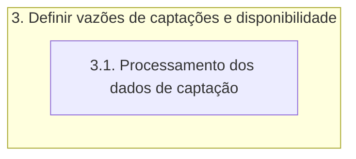

# Documentação - ParaibaHidroGIS

## 3. Definir vazões de disponibilidade e captações

>:bulb: **Ideia**: Os dados de disponibilidade já estão por ottobacias, caso não estivesse pronto, os dados teriam que ser tratados fazendo o cruzamento como se fosse os setores censitários.

O fluxograma de processos desta etapa é apresentado a seguir:

O módulo **psycopg2** é uma biblioteca do PostgreSQL para Python. Essa biblioteca permite a conexão e interação com um banco de dados PostgreSQL a partir do Python.

### 3.1. Processamento dos dados de captação

A função **processamento_captacoes** é definida para que possa se estabelecer uma conexão com o banco de dados PostgreSQL usando os parâmetros de cone~xão fornecidos anteriormente, além de criar um objeto cursor para executar comandos SQL no banco de dados.

Assim, é executado uma série de comandos SQL que serão descritos a seguir:

- **DROP VIEW IF EXISTS**: é utilizado para remover a view *captacoes_ottobacias* no schema atual se ela existir.
- **CASCADE**: é uma opção que remove todas as dependentes daquela VIEW. Isso garante que não haja nenhum objeto associado à VIEW removida.
- **CREAT VIEW**: é criada uma nova view chamada *captacoes_ottobacias* no schema atual.
- **SELECT, FROM, JOIN, GROUP BY, ORDER BY**: a view realiza uma consulta que seleciona a coluna *cobacia* da tabela *ottobacias_pb_5k* no schema basemap, e então é calculado a soma das captações solicitadas agrupadas por cobacia, usando informações das tabelas outorgas e ottobacias_pb_5k no schema especificado pelos parâmetros de conexão.

Depois disso é feito um commit das mudanças realizadas no banco de dados (conexao.commit), o cursor é fechado (cursor.close) e a conexão com o banco de dados é fechada (conexao.close).