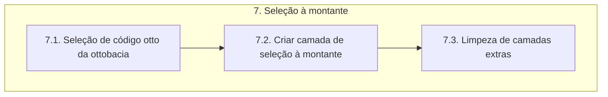

# Documentação - ParaibaHidroGIS

## 7. Seleção da ottobacia

O fluxograma de processos desta etapa é apresentado a seguir:

### 7.1. Seleção de código otto da ottobacia

É definida uma classe chamada **MapToolIdentify** que é uma extensão especializada da funcionalidade de identificação de feições fornecida pelo QGIS.

É estabelecida uma conexão com o banco de dados, através do dicionário parametros_conexao (setConnection). Depois, é definida a fonte de dados para a camada no QGIS, utilizando a variável basemap (schema), ottotrechos_pb_5k como o nome da tabela, geom como a coluna de geometria e cobacia como filtro de atributos. A variável **uri** configura e adiciona uma nova camada vetorial ao projeto do QGIS (**camada_ottotrechos**). 

É definida uma função com o método **__init__** que é o construtor da classe **MapToolIdentify** e é chamado quando uma instância da classe é criada. O método *super()* chama o construtor da classe **QgsMapToolIdentifyFeature** e o atributo *layer* é definido como a camada **ottobacias_isr**.

A função com o método **canvasReleaseEvent** é chamada sempre que ocorre um "clique" com o mouse no canvas do mapa. O método *super()* chama o **canvasReleaseEvent** para garantir que o comportamento padrão seja executado antes de executar qualquer código adicional.

A variável **feicao** identifica a feição na posição onde o mouse foi solto no canvas do mapa, usando a camada especificada. O **identify** retorna uma lista de feições naquela posição e seleciona a primeira feição. A partir dessa feição, obtemos o objeto *mFeature* que contém informações sobre a feição identificada.

A variável **cod_otto_bacia** recupera o valor do atributo *cobacia* da feição identificada, que representa o código da bacia hidrográfica.

### 7.2. Criar camada de seleção à montante

É estabelecida a conexão com o banco de dados PostgreSQL usando as informações de conexão fornecidas.

Depois, é executada uma consulta SQL para criar uma nova VIEW chamada **selecao_montante**, filtrando as feições da camada **ottobacias_isr** com base no **cod_otto_e** editado anteriormente. O comando **DROP VIEW IF EXISTS** exclui a visualização **selecao_montante**, se ela existir, juntamente com todas as dependências. O **CASCADE** garante que todas as dependências sejam excluídas juntamente com a visualização principal.

Sobre a consulta SQL:

- **DROP VIEW IF EXISTS**: exclui a VIEW chamada ottobacia_selecionada no schema especificado. 
- **CASCADE**: é utilizado para garantir que, se a VIEW já existir, ela seja excluída juntamente com todas as dependências.
- **CREATE VIEW**: cria a VIEW ottobacia_selecionada no schema especificado.
- **SELECT**: seleciona os campos da tabela resultado_balanco no schema especificado e a geometria da tabela ottobacias_pb_5k no schema basemap.
- **FROM & LEFT JOIN**: esse trecho especifica a fonte dos dados para a VIEW, utilizando uma junção esquerda entre a tabela resultado_balanco e a tabela ottobacias_pb_5k.
- **WHERE**: filtra as linhas da tabela com base em duas condições, primeiro a coluna cobacia é comparada com cod_otto_bacia e somente as linhas cujo valor começa com o mesmo valor serão selecionadas. Além disso, apenas as linhas com valores na coluna cobacia, maiores ou iguais a cod_otto_bacia são incluídas.

Por fim, confirma as alterações no banco de dados, fecha o cursor e a conexão com o banco após a execusão da consulta.

### 7.3. Limpeza de camadas extras

A função **limpeza_camadas_extras** remove várias camadas adicionais do projeto do QGIS. Essa função é chamada para garantir que as camadas extras não interfiram com o restante do processo.