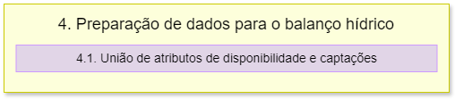

4. Preparação de dados para balanço hídrico
===========================================

O fluxograma de processos desta etapa é apresentado a seguir:

Primeiramente é importado o módulo **psycopg2**.

4.1 União entre disponibilidade hídrica e captações
---------------------------------------------------

A função **uniao_disp_cap** é definida para que possa se estabelecer uma conexão com o banco de dados PostgreSQL usando os parâmetros de conexão fornecidos anteriormente, além de criar um objeto cursor para executar comandos SQL no banco de dados.

Assim, é executado uma série de comandos SQL que serão descritos a seguir:

- **DROP VIEW IF EXISTS**: é utilizado para remover a view *dados_balanco* no schema atual se ela existir.
- **CASCADE**: é uma opção que remove todas as dependentes daquela VIEW. Isso garante que não haja nenhum objeto associado à VIEW removida.
- **CREAT VIEW**: é criada uma nova view chamada *dados_balanco* no schema atual.
- **SELECT, FROM, LEFT JOIN, ORDER BY**: a view realiza uma consulta que seleciona colunas específicas da tabela *ottotrechos_pb_5k* no schema *basemap* e colunas da tabela *disponibilidade_hidrica* no schema especificado pelos parâmetros de conexão, e posteriormente, as tabelas são unidas.
- **COALESCE**: é utilizado para lidar com valores nulos. Caso a coluna *captacao_solicitada* da tabela *captacoes_ottobacias* for nula, ela será substituída por 0.

Depois disso é feito um commit das mudanças realizadas no banco de dados (conexao.commit), o cursor é fechado (cursor.close) e a conexão com o banco de dados é fechada (conexao.close).