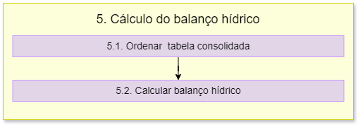

5. Cálculo do Balanço Hídrico
=============================

O fluxograma de processos desta etapa é apresentado a seguir:

Primeiramente é importado o módulo **psycopg2**.

5.1 Ordenar tabela consolidada
------------------------------

A função **criar_matriz** cria uma matriz de balanço hídrico a partir dos dados do banco de dados. 

Para isso é aberta a conexão com o banco de dados usando os parâmetros fornecidos. Depois, é criado um cursor a partir da conexão com o banco de dados para executar comandos SQL.

A primeira consulta SQL realizada seleciona (SELECT) todas as colunas da tabela **dados_balanco** no esquema especificado **schema_cenario** (FROM), ordenando (ORDER BY) os resultados pela coluna **cobacia** em ordem descendente (DESC).

A variável **rows** recupera todas as linhas resultantes da consulta SQL, enquanto a variável **matriz** será utilizada para armazenar os dados recuperados do banco de dados. Depois, é feito uma iteração sobre cada linha recuperada do banco de dados, onde para cada linha, a iteração converte os valores em uma lista de strings e adiciona essa lista à **matriz**.

A iteração da linha na matriz é realizada para adicionar zeros para criar novos campos que futuramente vão ser preenchidos no cálculo do balanço. 

5.2 Calculo do Balanço Hídrico
------------------------------

A função **calcular_balanco** calcula o balanço de disponibilidade e captação de recursos hídricos em cada linha da matriz.

Para isso são realizadas iterações sobre cada linha da matriz, onde primeiramente é realizada a verificação se a linha representa um trecho de cabeceira ou não. Se o trecho for de cabeceira, a função calcula a vazão jusante subtraindo a captação solicitada da vazão incremental na linha atual da matriz.

Então, é verificado se a vazão jusante calculada é menor que zero, caso a resposta seja sim, é calculado o déficit e depois, definida a vazão jusante como zero para calcular a captação atendida. Caso a resoista seja não, então a captação atendida é igual à captação solicitada e o déficit é zero. 

Se o trecho não for de cabeceira, a função calcula a vazão jusante considerando os trechos montantes correspondentes. É feita uma iteração reversa para encontrar trechos montantes, ou seja, o loop faz a iteração sobre as linhas anteriores à linha atual, de trás para frente, comparando o código do trecho atual com o código do trecho jusante do trecho anterior. 

Se houver um trecho montante correspondente, a vazão jusante do trecho atual é calculada somando as vazões jusantes dos trechos montantes. A vazão montante é armazenada na matriz. A vazão jusante é calculada somando a vazão montante calculada ao valor da disponibilidade local e subtraindo a captação. E então é calculado o déficit, semelhante ao explicado acima, com base na vazão jusante calculada.

O **campo_captacao_acumulada** atualiza a captação acumulada somando a mesma com as linhas anteriores, tendo um máximo de soma dela mesma com duas linhas anteriores.

O cálculo do **Índice de Condição de Recursos Hídricos (ISR)** é feito com base na relação entre a soma da captação acumulada com o déficit e a vazão natural. Essa relação é dividida em intervalos e o ISR é atribuído de acordo com esses intervalos. 

Por fim, a função retorna a matriz com os cálculos de vazão jusante, déficit e ISR para cada linha.

5.2.1 Salvar resultados
~~~~~~~~~~~~~~~~~~~~~~~

A função **salvar_resultado** tem a finalidade de salvar os resultados do balanço hídrico em um banco de dados PostgreSQL. Primeiramente é realizada a conexão com o banco de dados usando os parâmetros de conexão. Depois, é criado um objeto de cursor para exercutar comandos SQL no banco de dados. Então são definidos os nomes dos campos que serão utilizados para criar as VIEWS no banco de dados. 

Com o **cursor.execute** são executados os comandos SQL para criar uma VIEW chamada **resultado_balanco** no banco de dados. Essa view contém os campos especificados na lista *campos* e os dados da matriz **matriz_balanco**

Um processo semelhante é realizado para a VIEW **ottobacias_isr**. Essa VIEW contém informações sobre a cobacia, geometria, ISR e classe de ISR, obtidas a partir da tabela *ottobacias_pb_5k* e da view *resultado_balanco*. Por fim, é feito um commit para que as alterações sejam salvas no banco de dados, o cursor é fechado e a conexão com o banco de dados é encerrada.

Os comandos utilizados SQL são: 

- DROP VIEW IF EXISTS
- CREAT VIEW
- SELECT, FROM
- ORDER BY
- LEFT JOIN

Os comandos já foram descritos anteriormente nos itens 3 e 4.