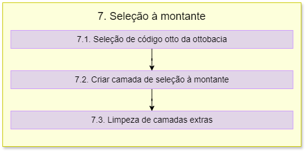

7. Seleção da ottobacia
=======================

O fluxograma de processos desta etapa é apresentado a seguir:

Primeiramente é importado o módulo **psycopg2**.

7.1. Seleção de código otto da ottobacia
----------------------------------------

É definida uma classe chamada **PointTool** que é uma extensão especializada da funcionalidade de identificação de feições fornecida pelo QGIS. Essa ferramenta permite a captura de pontos no mapa clicando na tela do canvas. Ela herda de **QgsMapToolEmitPoint** que é uma classe base do QGIS.

.. note::
    A classe **QgsMapToolEmitPoint** é usada para criar ferramentas que respondem a eventos de cliques no mapa, emitindo a posição geográfica dos pontos clicados. 

É definida uma função com o método **__init__** que é o construtor da classe **QgsMapToolEmitPoint** e é chamado quando uma instância da classe é criada. 

A função com o método **canvasReleaseEvent** é chamada sempre que ocorre um "clique" com o mouse no canvas do mapa. A variável **disconnect_signal** verifica se a ferramenta está ativa para capturar um clique, se for *false*, a ferramenta processará o clique. Quando a variável **disconnect_signal** for *true* não será feita a captura de cliques. 

A variável **point** converte a posição do clique para coordenadas de mapa. **lat_ponto** e **long_ponto** extraem a latitude e a longitude do ponto clicado, respectivamente. 

Depois, é feita uma consulta espacial para encontrar a bacia hidrográfica do ponto selecionado. A variável **ottobacia_selecionada** vai criar uma camada vetorial virtual executando uma consulta SQL para selecionar a bacia (camada_ottobacias_isr) que contém o ponto clicado. A camada resultante é adicionada ao projeto QGIS, mas não é exibida na legenda. A variável **cod_otto_bacia** é definida como a variável global para armazenar o código da ottobacia. 

A variável **ponto_interesse** é estabelecida para fazer a adição do ponto de interesse ao mapa. Para isso, é criada uma camada vetorial virtual com o ponto de interesse e verificado se a camada já existe no projeto. 

- Se a camada existe, obtém a referência para a camada existente e remove a mesma do projeto. A nova camada de ponto é adicionada ao projeto. 
- Se a camada não existe é configurada uma conexão com o banco de dados PostgreSQL. Então é criada uma camada vetorial  a partir de uma tabela do banco de dados (ottotrechos_pb_5k). E por fim, cria e ativa uma ferramenta (point_tool) de captura de pontos no canvas do mapa.