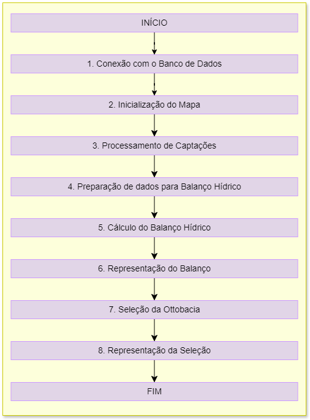

==========================================
Documentação do Aplicativo ParaibaHidroGIS
==========================================

**Paraiba HidroGIS** é um aplicativo desenvolvido para análise de bacias hidrográficas desenvolvido no contexto do Plano de Recursos Hídricos da Bacia Hidrográfia do Rio Paraíba (PRH-RPB).

Resumo da ferramenta
--------------------

Esta ferramenta está sendo desenvolvida com o propósito de servir para o auxílio nos trabalhos de projetos de Recursos Hídricos, sendo um facilitador nos procedimentos de cálculo do balanço hídrico.

O desenvolvimento é realizado no contexto do projeto do Plano de Recursos Hídricos da Bacia do Rio Paraíba (PRH-BPB).

Baseado na liguagem de programação python incorporada ao software QGIS.

Objetivos da documentação
-------------------------

Esta documentação tem por objetivo primordial orientar a equipe de desenvolvimento de modo a detalhar todas as etapas e processos de execução da ferramenta. Deve ser utilizada também como material de consulta para utilização por profissionais envovidos nas etapas de testes e validação de suas funcionalidades.

Estrutura
---------

A estrutura funcional da ferramenta foi criada de forma hierarquica de modo a propiciar melhor entendimento sobre todo os detalhes das etapas envolvidas no processo de execução da ferramenta. Para isto, foram definidos os conceitos de Etapas, Processos e Funções.

**ETAPAS:** O primeiro nível de organização estrutural. Neste nível abstrai-se qualquer tipo de detalhamento, sendo apenas descritos de forma geral o processo do início ao fim.

**PROCESSOS:** O segundo nível de organização estrutural. Neste nível apresenta-se um detalhamento maior das etapas, a fim de que se possa diminuir o nível de abastração e identificar melhor as funcionalidades.

**FUNÇÕES:** O terceiro nível de organização estrutural. Neste nível são detalhadas todas as funções executadas em cada processo, de modo individual. É o nível com menor grau de abstração, sendo possível identificar todas as estruturas funcionais da ferramenta.

Fluxograma de etapas
--------------------

Conteúdo
--------

.. toctree::
   
   1conexaoBancoDados
   2inicializacaoMapa
   3processamentoCaptacao
   4preparacaoDadosBalanco
   5calculoBalanco
   6representacaoBalanco
   7definirOttobacia
   8representacaoSelecao
   9codigosAuxiliares
   10proximosPassos